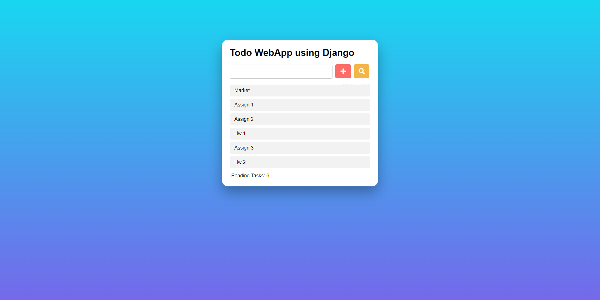
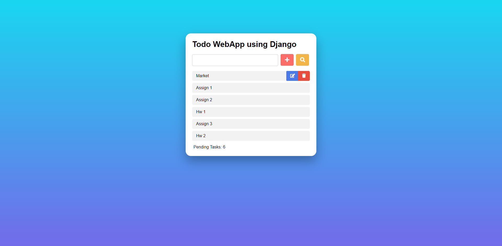
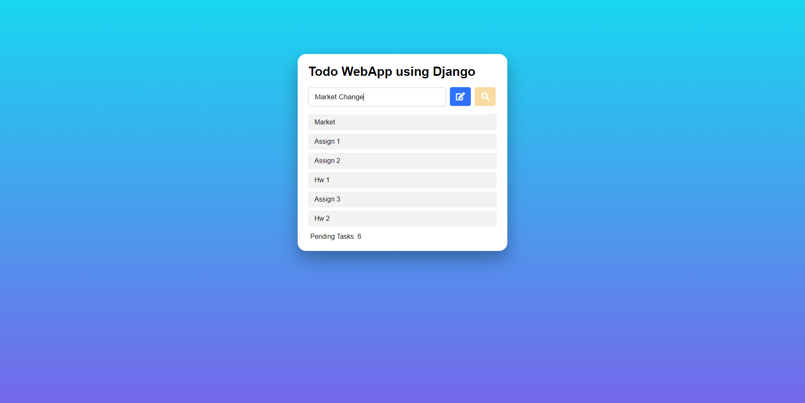

# Todo-Django
Implemented a Todo list using Django which is a high-level Python web framework that encourages rapid development and clean, pragmatic design.

## Technology Stack :
* HTML
* CSS
* Bootstrap
* Python-Django

## Quick Start
Start the server using runserver command from manage.py
```
$ python manage.py runserver
```

## Output Screenshots
### Todo List


### Edit Delete buttons

Edit and Delete icons pop up when the cursor is hovered on a task

### Edit Task

If edit icon is clicked we can change the task and the changes will reflect on the todo list
